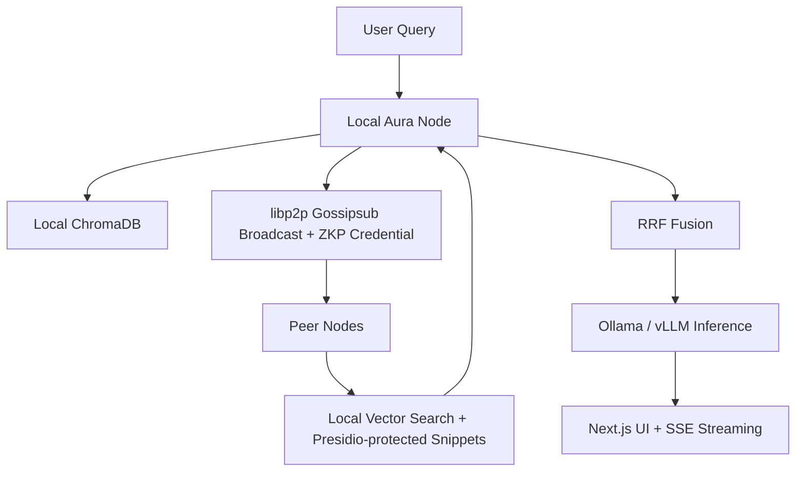

# 🌐 Project AURA – Advanced Universal Retrieval Architecture (Decentralized Edition)

**A sovereign, local-first, peer-to-peer Federated RAG platform.**  
Your company’s knowledge lives on employee laptops — not in the cloud. Zero data leaves the trusted mesh.

[](LICENSE)
[](https://www.python.org/)
[](https://docker.com)

---

### ✨ What is AURA?

AURA turns every workstation into an **Aura Node** — a fully independent, secure knowledge shard in a decentralized P2P mesh.

- Documents stay 100 % on-device (ingested → redacted → vectorized locally).
- Queries are broadcast securely via libp2p Gossipsub.
- Authorized peers return encrypted snippets; your local LLM (Ollama + vLLM) synthesizes the answer.
- Raw data **never** touches the public internet or a central server.

Built as a **portfolio-grade side project** to master:
- Distributed systems & P2P networking
- Applied cryptography (DIDs + ZKPs)
- Edge AI / quantized inference
- GreenOps & sustainable infrastructure
- High-performance local RAG

---

### 🚀 Key Features

- **True local-first sovereignty** – No cloud, no S3, no central vector DB
- **Zero-trust security** – Polygon ID DIDs + Zero-Knowledge Proofs for authorization
- **Tamper-proof integrity** – IPFS Kubo CIDs + SHA-256 on every document
- **PII protection** – Microsoft Presidio redaction pipeline (runs before vectorization)
- **Federated RAG with Reciprocal Rank Fusion (RRF)**
- **Carbon-aware scheduling** – Delays background indexing during high-carbon grid periods
- **Real-time streaming UI** – Next.js 15 + Server-Sent Events
- **Observable & measurable** – Prometheus metrics + SCI (Software Carbon Intensity) dashboard
- **Document revocation** – Live deletion/update propagation across the mesh
- **Model consistency** – Pinned LLM manifest shared via gossip
- **One-command multi-node demo** – `docker compose up`

---

### 🏗️ Architecture Overview



Full architecture diagram available in `/docs/architecture.md`.

---

### 🛠️ Tech Stack

| Layer              | Technology                          | Purpose |
|--------------------|-------------------------------------|---------|
| P2P Networking     | py-libp2p + Gossipsub               | Discovery, NAT traversal, encrypted broadcast |
| AI Inference       | Ollama + vLLM (quantized Llama 3.2/Mistral) | Edge LLM serving |
| Vector Store       | ChromaDB (embedded)                 | Local retrieval |
| Document Storage   | IPFS Kubo                           | Content-addressed integrity & revocation |
| Security           | Polygon ID (DIDs + ZKPs) + Ed25519  | Zero-trust authorization |
| PII Redaction      | Microsoft Presidio                  | Local privacy pipeline |
| Backend            | FastAPI (async)                     | API & protocol bridge |
| Frontend           | Next.js 15 + TailwindCSS            | Real-time UI |
| Observability      | Prometheus + Grafana                | Metrics & GreenOps dashboard |
| Deployment         | Docker + docker-compose             | Multi-node testing |

---

### 📥 Quick Start (Local Demo in < 5 minutes)

```bash
# 1. Clone & start the mesh
git clone https://github.com/yourusername/aura.git
cd aura
docker compose up -d --scale node=2   # starts 2 nodes on your machine

# 2. Ingest sample docs on Node 1
docker exec aura-node-1 python ingest.py --dir ./sample_docs

# 3. Open the UI
open http://localhost:3000
```

Ask a question that only exists in Node 2’s documents → watch the magic happen instantly over the LAN.

**Hardware requirement**: 16 GB RAM minimum per node (GPU optional for vLLM heavy-lifter).

---

### 🗺️ Roadmap (Current Status)

- ✅ **Local RAG** – Sovereign local node (offline)
- ✅ **P2P Mesh** – Full libp2p Gossipsub mesh
- ✅ **Federated RAG** – Distributed retrieval + RRF fusion
- ✅ **Zero-Trust Security** – Polygon ID ZKPs + IPFS integrity + Presidio
- ✅ **Observability** – Next.js UI + Prometheus + GreenOps dashboard
- 🔄 **Resilience** – Document revocation, model manifest, query obfuscation, encrypted backups (in progress)

---

### 📊 Sustainability (GreenOps)

- Tracks **Software Carbon Intensity (SCI)** in real time
- Carbon-aware background tasks (uses grid-intensity API)
- Dashboard shows “kg CO₂ saved vs. cloud equivalent”

---

### 🧪 Testing & Chaos Engineering

- Full `pytest` suite with asyncio
- Automated chaos monkey (randomly kills peers, corrupts CIDs, simulates laptop sleep)
- Multi-node integration tests via Docker Compose

---

### 📸 Demo

[Watch 90-second demo video](https://youtu.be/your-demo-video)  
*(Two laptops on Wi-Fi → drop confidential PDF on one → ask question on the other → instant answer with zero cloud)*

---

### 🤝 Contributing

We welcome PRs! See [CONTRIBUTING.md](CONTRIBUTING.md)  
Especially interested in:
- Rust libp2p performance port
- Additional ZKP circuits
- Advanced GreenOps integrations

---

### 📄 License

MIT © 2026 Your Name  
(Feel free to use this as a portfolio piece — just keep the attribution link in the README.)

---

**Made with ❤️ to push the boundaries of local-first AI infrastructure.**
